# Hama DB ERD

2026-06-12 라이브 Supabase DB 기준. DDL은 [db_schema.sql](db_schema.sql), 컬럼 상세는 [db_column_catalog.md](db_column_catalog.md) 참고.

> 이전 버전 ERD 이미지(`ERD.drawio.png`)는 설계 초안 기준이라 현재 스키마와 다릅니다. 이 문서가 최신입니다.

## 전체 관계도

```mermaid
erDiagram
    users ||--o| notification_settings : "알림 설정 (1:1)"
    users ||--o{ wishlists : "찜"
    users ||--o{ item_views : "최근 본 상품"
    users ||--o{ keyword_alerts : "키워드 알림"
    users ||--o{ notifications : "알림 수신"
    users ||--o{ search_logs : "검색 기록"
    users ||--o{ search_events : "검색 이벤트"
    users ||--o{ chat_history : "챗봇 대화"
    users ||--o{ recommended_items : "추천 기록"

    platforms ||--o{ items : "출처 플랫폼"
    items ||--o{ price_history : "가격 이력"
    items ||--o{ wishlists : "찜 대상"
    items ||--o{ item_views : "조회 대상"
    items ||--o{ notifications : "알림 대상"
    items ||--o{ search_events : "노출/클릭"
    items ||--o{ search_logs : "클릭 상품"
    items ||--o{ item_search_matches : "키워드 매칭"
    items ||--o{ recommended_items : "추천 상품"

    users {
        bigint user_id PK
        varchar login_id UK
        varchar email UK
        varchar password
        varchar name
        varchar nickname UK
        varchar account_status "ACTIVE | WITHDRAWN"
        varchar role "USER | ADMIN"
        timestamp created_at
    }

    platforms {
        bigint platform_id PK
        text platform_name UK "번개장터 | 중고나라"
        boolean is_active
    }

    items {
        bigint item_id PK
        bigint platform_id FK
        text platform_name "비정규화(트리거 동기화)"
        text original_id "플랫폼 상품 ID"
        text canonical_name "표준 상품명"
        text cluster_product_name "클러스터명(파생)"
        text title
        integer current_price
        text status "판매중|예약중|판매완료"
        numeric rating "종합 점수(파생)"
        numeric cluster_confidence "클러스터 신뢰도"
        integer view_count
        timestamptz crawled_at
    }

    price_history {
        bigint history_id PK
        bigint item_id FK
        integer price
        date recorded_at
    }

    wishlists {
        bigint wish_id PK
        bigint user_id FK
        bigint item_id FK
        bigint target_price
        varchar is_lowest_alert "Y/N"
        timestamp added_at
    }

    item_views {
        bigint view_id PK
        bigint user_id FK
        bigint item_id FK
        timestamp viewed_at
    }

    notifications {
        bigint notification_id PK
        bigint user_id FK
        bigint item_id FK
        varchar notification_type
        varchar is_read "Y/N"
        varchar send_status "PENDING..."
    }

    notification_settings {
        bigint setting_id PK
        bigint user_id FK "1:1 (unique)"
        varchar lowest_price_enabled "Y/N"
        varchar sold_status_enabled "Y/N"
        varchar new_item_enabled "Y/N"
    }

    keyword_alerts {
        bigint keyword_alert_id PK
        bigint user_id FK
        varchar keyword
        varchar is_active "Y/N"
    }

    search_logs {
        bigint log_id PK
        bigint user_id FK
        varchar keyword
        bigint clicked_item_id FK
    }

    search_events {
        bigint event_id PK
        bigint user_id FK
        bigint item_id FK
        text keyword
        text event_type "SEARCH|IMPRESSION|CLICK"
        integer result_rank
    }

    item_search_matches {
        bigint match_id PK
        bigint item_id FK
        text keyword
        numeric match_score
        text match_source
    }

    chat_history {
        bigint chat_id PK
        bigint user_id FK
        text user_message
        text bot_response
        varchar intent
        varchar response_type
    }

    recommended_items {
        bigint recommend_id PK
        bigint user_id FK
        bigint item_id FK
        integer score
        varchar recommend_type "CHATBOT_RECOMMEND 등"
    }
```



## 독립 테이블 (FK 없음)

```mermaid
erDiagram
    price_stats_daily {
        bigint stat_id PK
        text canonical_name "상품명 기준 일별 집계"
        date stat_date
        integer lowest_price
        numeric average_price
        integer item_count
    }

    keyword_price_daily {
        bigint trend_id PK
        text keyword "키워드 기준 일별 시세"
        date recorded_at
        integer lowest_price
        integer average_price
        integer sample_count
    }

    search_rankings {
        bigint rank_id PK
        text keyword "검색 순위 집계"
        integer search_count
        text trend_status
    }

    chat_faq {
        bigint faq_id PK
        text question_pattern "FAQ 질문 패턴"
        text answer_text
    }

    user_preferences {
        bigint pref_id PK
        bigint user_id "FK 미설정"
        text preferred_tag
    }

    content_pages {
        bigint content_id PK
        text content_type "NOTICE|TERMS|PRIVACY|FAQ|GUIDE"
        text title
        boolean is_active
    }

    banners {
        bigint banner_id PK
        text image_url
        integer display_order
        boolean is_active
    }
```



## 데이터 흐름 요약

```text
크롤링 CSV (번개장터/중고나라)
  → import_csv_to_supabase.py → items + price_history
  → keyword_final 파이프라인 → items.cluster_product_name / cluster_confidence / rating
  → opensearch/sync_from_supabase.py → OpenSearch hama_items 인덱스 (quality_flags 부여)

검색 요청 → FastAPI → OpenSearch (검색·시세 집계, 정크 플래그 제외)
상세/비교 차트 → FastAPI → items + price_history 온더플라이 클러스터 집계
회원/찜/알림/챗봇 → Spring Boot → users/wishlists/notifications/chat_* 테이블
```
