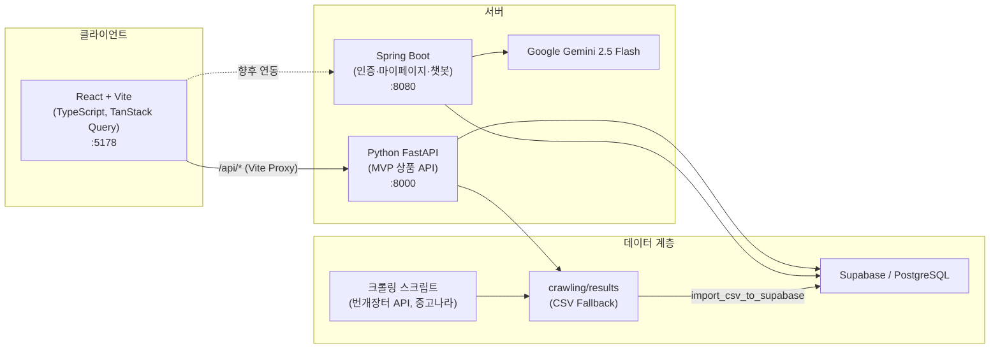

# Hama — 포트폴리오 초안

> 아래 초안은 저장소 전체(`README`, `docs/`, `code/`)를 기준으로 작성했습니다.  
> **프로필(3번)·담당 역할(4-2번)** 은 본인 정보에 맞게 수정하세요.  
> 다이어그램·ERD 이미지는 `docs/ERD.drawio.png`를 첨부하고, 시스템 아키텍처는 아래 mermaid를 이미지로 변환해 넣으면 됩니다.

---

## 1. 표지

```
┌─────────────────────────────────────────────┐
│                                             │
│              Hama (하마)                    │
│   중고거래 플랫폼 통합 검색·가격 비교 서비스   │
│                                             │
│         KDT 팀 프로젝트 | 사육사조            │
│              2026. 06                       │
│                                             │
│         [이름]  |  [역할]  |  [연락처]        │
│                                             │
└─────────────────────────────────────────────┘
```

---

## 2. 목차

1. [표지](#1-표지)
2. [목차](#2-목차)
3. [프로필](#3-프로필)
4. [프로젝트 상세](#4-프로젝트-상세)
   - 4-1. 개요
   - 4-2. 담당 역할
   - 4-3. 요구사항 및 문제 정의
   - 4-4. 서비스 아키텍처/설계
   - 4-5. 주요 구현 기능 및 문서 링크
   - 4-6. 기술 선택 이유
   - 4-7. 트러블슈팅 및 개선 내용
   - 4-8. 테스트 및 검증
   - 4-9. 결과 및 성과
5. [기타: GitHub, 노션, 데모 링크](#5-기타-github-노션-데모-링크)
6. [회고 및 성장 계획](#6-회고-및-성장-계획)

---

## 3. 프로필

| 항목 | 내용 |
|------|------|
| **이름** | [본인 이름] |
| **역할** | [예: PM / 데이터 파이프라인 / 프론트엔드 / 백엔드 / DB 설계] |
| **소속** | KDT 4기 · 팀 **사육사조** |
| **GitHub** | [본인 GitHub URL] |
| **기술 스택** | Python, FastAPI, React, TypeScript, Spring Boot, PostgreSQL(Supabase), Jupyter |
| **한 줄 소개** | 여러 중고거래 플랫폼의 상품 데이터를 통합·정제하여 검색·가격 비교 서비스를 구현한 KDT 팀 프로젝트에 참여했습니다. |

### 팀 구성

| 이름 | 역할 | GitHub |
|------|------|--------|
| 정지원 | 팀장, 백엔드 & DB 설계, 레포 관리 | https://github.com/jiwon-jung323 |
| 정우진 | PM, 데이터 수집 파이프라인, 프론트 구조·UI | https://github.com/rainstorm0907 |
| 김다은 | 프론트엔드, 홈·공통 컴포넌트 | https://github.com/rlekdm |
| 이준호 | 백엔드, AI 챗봇 | https://github.com/dlwnsgh1130 |

---

## 4. 프로젝트 상세

### 4-1. 개요

**Hama(하마)** 는 번개장터, 중고나라 등 **중고거래 플랫폼의 상품 데이터를 통합 수집·정제**하여, 사용자가 한 화면에서 **검색, 가격 비교, 가격 추이 확인, 찜, 추천, 알림**을 할 수 있는 웹 서비스입니다.

| 항목 | 내용 |
|------|------|
| **프로젝트 기간** | 2026.04 ~ 2026.06 (KDT 과정) |
| **팀명** | 사육사조 |
| **서비스 형태** | 웹 애플리케이션 (로컬 MVP) |
| **핵심 가치** | 멀티 플랫폼 상품 통합 검색, `canonical_name`(표준 상품명) 기반 가격 통계, 데이터 정합성 검증 파이프라인 |
| **현재 구현 수준** | 상품 검색/추천/상세 API 연동 완료, 계정·찜·알림·챗봇은 UI 또는 Spring 백엔드 코드 구현 단계 |

---

### 4-2. 담당 역할

> 아래는 팀원별 역할 예시입니다. 본인 항목만 남기고 구체적인 기여를 적어주세요.

**[본인 이름] — [역할]**

- [ ] 프로젝트 일정·요구사항 관리, Notion 문서 체계화
- [ ] 크롤링 데이터 수집 파이프라인 설계 및 `keyword_list.csv` 표준 상품명 관리
- [ ] `keyword_matches_title()` 규칙 기반 검색 정합성 필터 설계·구현
- [ ] 가격 이상치 분석 노트북(`keyword_price_outliers*.ipynb`, `keyword_final.ipynb`) 작성
- [ ] FastAPI MVP API 서버(`api_server.py`) 및 Supabase/CSV fallback 구조 설계
- [ ] React 프론트엔드 구조 설계, TanStack Query 기반 API 연동
- [ ] Spring Boot 인증·마이페이지 API 구현
- [ ] Gemini AI 챗봇 서비스 구현

**기여 예시 (정우진 / PM·데이터 파이프라인 기준)**

- 크롤링 결과 20,000건+ no-filter 데이터(`통합조회_전체_no_filter_20260605_1142.csv`) 기반 정합성·이상치 분석
- `HamaDataPipeline` + Aho-Corasick 토큰 매칭으로 상품명 표준화 파이프라인 구축
- 필터 적용/미적용 버전 비교로 번개장터 오탐률 정량화 (5,515건 → 8,078건, 차이 2,563건)
- FastAPI + Supabase 이중 데이터 소스 전략으로 개발 환경 유연성 확보

---

### 4-3. 요구사항 및 문제 정의

#### 배경 및 문제

중고거래는 플랫폼마다 가격·상품명 표기가 달라, 동일 상품을 비교하려면 여러 앱을 오가야 합니다. 또한 번개장터 API는 검색어와 느슨하게 매칭된 후보를 많이 반환해 **오탐 상품이 가격 통계를 왜곡**합니다.

| 문제 | 구체적 사례 |
|------|------------|
| 플랫폼 분산 | 번개장터·중고나라를 각각 검색해야 함 |
| 검색 오탐 | `갤럭시 s26` 검색 시 `갤럭시S24`, `s23FE` 등 다른 모델 포함 |
| 액세서리 혼입 | 케이스·필름·맥세이프 상품이 본체 가격 통계에 섞임 |
| 모델명 파싱 한계 | `아이폰 17e`가 `17`+`e`로 분리되어 오매칭 |
| 가격 이상치 | 키워드별 이상치 비율 최대 40%+(예: 골드바 40.7%) |

#### 핵심 요구사항

| ID | 요구사항 | 우선순위 |
|----|----------|----------|
| FR-01 | 멀티 플랫폼 상품 통합 검색 (키워드, 플랫폼 필터, 정렬, 페이지네이션) | 필수 |
| FR-02 | 표준 상품명(`canonical_name`) 기반 가격 통계·시세 추이 | 필수 |
| FR-03 | 크롤링 데이터 정합성 검증 및 이상치 필터링 | 필수 |
| FR-04 | 찜, 최근 본 상품, 알림, 가격 비교 | 중요 |
| FR-05 | 회원가입·로그인·마이페이지 | 중요 |
| FR-06 | AI 챗봇 기반 상품 상담·추천 | 선택 |
| FR-07 | 관리자 대시보드 (KPI, 이상 데이터 모니터링) | 선택 |

#### 요구사항 정의서

- **Notion 프로젝트 문서**: https://suave-kip-fd7.notion.site/KDT-350c2695cef080ec881ad5a86bdd8da8
- **저장소 문서**: `docs/requirements.md`, `docs/search_relevance_plan.md`

---

### 4-4. 서비스 아키텍처/설계

#### 시스템 아키텍처 다이어그램

> **이미지 첨부 위치**: 아래 다이어그램을 draw.io/Figma로 시각화하여 삽입



**데이터 흐름 요약**

1. 크롤링 스크립트가 번개장터 API·중고나라 웹에서 상품 데이터 수집
2. `keyword_matches_title()` 필터 및 `HamaDataPipeline`으로 표준화
3. Supabase 적재 또는 CSV 로컬 보관
4. FastAPI가 Supabase(우선) 또는 CSV(fallback)에서 상품 조회
5. React 프론트가 `/api` 프록시를 통해 FastAPI 호출

#### ERD (Entity Relationship Diagram)

> **이미지 첨부**: `docs/ERD.drawio.png`  
> **DDL 문서**: `docs/db_schema.sql`(Oracle 설계안), `docs/supabase_schema.sql`(운영 MVP)

**설계 의도 요약**

| 영역 | 테이블 | 설계 의도 |
|------|--------|-----------|
| 사용자 | `users` | Supabase Auth(`auth.users`)와 연동, UUID PK. Spring 초기 설계는 `NUMBER` PK |
| 상품 | `items`, `platforms` | `platform_id + original_id` 유니크로 중복 방지. `canonical_name`으로 가격 집계 |
| 시세 | `price_history` | 일별 가격 이력, `item_id + recorded_at` 유니크 |
| 사용자 행동 | `wishlists`, `item_views`, `search_logs` | 찜·최근 본 상품·검색 로그 |
| 알림 | `notifications`, `keyword_alerts`, `notification_settings` | 가격·판매상태·키워드 알림 |
| 검색 분석 | `search_events`, `item_search_matches` | 검색 정합성·매칭 근거 추적 (Oracle 설계안) |
| 챗봇 | `chat_history`, `chat_faq`, `recommended_items` | Gemini 대화 이력·FAQ·추천 상품 |

**핵심 관계**

- `items` ↔ `platforms` (N:1)
- `price_history` → `items` (N:1, CASCADE DELETE)
- `wishlists` → `users` + `items` (N:1, 유저·상품 유니크)
- `users.user_id` → `auth.users.id` (Supabase Auth 연동)

---

### 4-5. 주요 구현 기능 및 문서 링크

#### 요구사항 정의서

| 문서 | 링크/경로 |
|------|-----------|
| Notion KDT 프로젝트 | https://suave-kip-fd7.notion.site/KDT-350c2695cef080ec881ad5a86bdd8da8 |
| 요구사항 및 작성 기준 | `docs/requirements.md` |
| 검색 정합성 계획 | `docs/search_relevance_plan.md` |
| 구현 체크리스트 | `docs/document_checklist.md` |
| 데이터 명세서 | `docs/데이터 명세서.xlsx` |

#### API 명세서

| API | 문서/배포 | 비고 |
|-----|-----------|------|
| FastAPI MVP (현재 프론트 연동) | `docs/api_spec.md` | 로컬 `http://127.0.0.1:8000` |
| Spring Boot 통합 API | `docs/api_spec.md` | 로컬 `http://127.0.0.1:8080`, Swagger 미배포 |
| Health Check | `GET /api/health` | `dataSource`: supabase / csv |

**FastAPI 주요 엔드포인트**

```
GET  /api/health
GET  /api/products/search?q=&platforms=&sort=&page=&limit=
GET  /api/products/recommended?limit=
GET  /api/products/{platform}/{pid}
```

**Spring Boot 주요 엔드포인트**

```
POST /api/auth/signup, /api/auth/login
GET  /api/products/search, /api/products/recommended
GET  /api/mypage/profile, /api/mypage/wishlists
POST /api/chatbot/message
GET  /api/chatbot/history/recent
```

#### 기능별 핵심 코드/로직

**1) FastAPI 기반 RESTful 상품 API + Supabase/CSV 이중 데이터 소스**

- 파일: `code/backend/src/main/python/api_server.py`
- Supabase 미설정 시 `crawling/results` 최신 CSV를 자동 fallback
- 상품 검색·정렬·페이지네이션·가격 요약(`summary`) 제공
- Health Check: `GET /api/health` → `dataSource: supabase | csv`

**2) Aho-Corasick 기반 상품명 토큰 매칭 파이프라인**

- 파일: `code/backend/src/main/python/hama_data_pipeline.py`
- `pyahocorasick`으로 상품 토큰 사전 고속 매칭
- `canonical_name`, `matched_keywords`, 카테고리 규칙 배정

**3) 규칙 기반 검색 정합성 필터**

- 파일: `code/backend/src/main/python/analysis/check_title_keyword_accuracy.py`
- `+`/`plus`/`pro`/`max`/`ultra` 표기 정규화
- 모델명 토큰(`s25`, `17e`) 경계 매칭으로 부분 일치 오탐 방지

**4) React + TanStack Query 프론트엔드 API 연동**

- `code/frontend/Hama/src/api/products.ts` — 타입 안전 API 호출
- `code/frontend/Hama/src/queries/productQueries.ts` — 캐싱·재요청 관리
- Vite 프록시: `/api` → `http://127.0.0.1:8000`

**5) Spring Security 기반 인증·인가 구조**

- 파일: `code/backend/src/main/java/com/used/service/config/SecurityConfig.java`
- BCrypt 비밀번호 암호화, 세션 기반 인증
- 상품 API는 공개, 마이페이지·챗봇은 인증 필요

**6) Gemini AI 챗봇 (Spring Boot)**

- `ChatbotService`, `GeminiClientService`, `PriceAdviceService`, `RecommendationService`
- FAQ 패턴 매칭 + Gemini 2.5 Flash LLM 하이브리드 응답

---

### 4-6. 기술 선택 이유

| 기술 | 선택 이유 |
|------|-----------|
| **React 19 + Vite + TypeScript** | 컴포넌트 재사용·타입 안전성, 빠른 HMR로 MVP 시연에 적합 |
| **TanStack Query** | 상품 검색·추천 API 캐싱, 로딩/에러 상태 일관 관리 |
| **Tailwind CSS** | 반응형 UI를 빠르게 구현, 디자인 시스템 일관성 |
| **Python FastAPI** | 크롤링·분석 파이프라인과 동일 언어, Pandas 연동 용이, MVP API 신속 구축 |
| **pyahocorasick** | 수천 개 키워드 토큰을 상품명에서 O(n) 시간에 매칭 |
| **Spring Boot 4 + Java 21** | KDT 과정 요구사항, 인증·JPA·REST API 표준 구조, 챗봇 등 풀스택 기능 |
| **Supabase (PostgreSQL)** | Auth·RLS·REST API 내장, 클라우드 DB로 팀 협업 용이, Oracle 설계안을 PostgreSQL로 전환 |
| **CSV Fallback** | Supabase 미설정 환경에서도 로컬 시연 가능, 개발 진입 장벽 최소화 |
| **Jupyter Notebook** | 가격 이상치·클러스터 분석의 탐색적 분석·시각화·재현성 |
| **Google Gemini 2.5 Flash** | 상품 상담·가격 조언에 필요한 한국어 LLM, API 비용·응답 속도 균형 |

---

### 4-7. 트러블슈팅 및 개선 내용

#### Case 1: 번개장터 검색 오탐으로 가격 통계 왜곡

| 항목 | 내용 |
|------|------|
| **Situation** | `갤럭시 s26` 검색 시 `갤럭시S24`, `s23FE` 등 다른 모델이 결과에 포함. 필터 미적용 시 8,078건, 적용 시 5,515건으로 2,563건 차이 |
| **Cause** | 번개장터 API가 검색어와 느슨하게 매칭된 후보를 반환. 플랫폼 원본 결과를 그대로 저장하면 `canonical_name` 기준 가격 통계가 왜곡됨 |
| **Solution** | `keyword_matches_title()` 규칙 필터 도입 — 텍스트 정규화(`+`→`플러스`, `pro`→`프로`), 토큰화, 경계 매칭. 필터/no-filter 버전 분리 비교 |
| **Result** | 번개장터 오탐 2,563건 제거. `analysis/results/title_keyword_accuracy/`에 정합성 검사 결과 CSV 생성. 중고나라는 필터 전후 차이 7건으로 상대적으로 안정 |

#### Case 2: Supabase 미설정 환경에서 API 서버 기동 불가

| 항목 | 내용 |
|------|------|
| **Situation** | 팀원마다 Supabase 계정·환경변수 설정 상태가 달라 API 서버 실행 실패 |
| **Cause** | 초기 설계가 Supabase 단일 데이터 소스 전제 |
| **Solution** | `supabase_repository.py`에 `is_supabase_configured()` 체크 추가. 미설정 시 `crawling/results` 최신 CSV 자동 로드. `/api/health`에 `dataSource` 필드 노출 |
| **Result** | `.env` 없이도 로컬 시연 가능. Health Check로 현재 데이터 소스 즉시 확인 |

#### Case 3: `아이폰 17e` 모델명 토큰 분리 오매칭

| 항목 | 내용 |
|------|------|
| **Situation** | `17e`가 `17`과 `e`로 분리되어 `case`, `MagSafe` 등의 `e`와 잘못 매칭 |
| **Cause** | 토큰화 패턴 `[a-z]+[0-9]+|[가-힣]+|[a-z]+|\d+`가 `17e`를 하나의 토큰으로 인식하지 못함 |
| **Solution** | 패턴을 `[a-z]+[0-9]+[a-z]?`로 확장해 `17e` 단일 토큰 처리. `token_matches_title()`에 영문+숫자+알파벳 경계 검사 추가 |
| **Result** | `check_title_keyword_accuracy.py`로 토큰 분리 케이스 정량 검증. 향후 ML 분류 모델 1차 후보 특징으로 등록 (`docs/search_relevance_plan.md`) |

#### Case 4: 가격 이상치가 키워드별 평균가를 왜곡

| 항목 | 내용 |
|------|------|
| **Situation** | `골드바` 키워드 이상치 비율 40.7%, `스텔라이브` 30.6% 등 고가·저가 노이즈 다수 |
| **Cause** | 액세서리·호환 상품 혼입, 판매자 관리번호(`[01272]`) 등 대괄호 노이즈, 플랫폼별 가격 분포 차이 |
| **Solution** | IQR 기반 이상치 분석 노트북(`keyword_price_outliers.ipynb`, `keyword_price_outliers_first_filter.ipynb`). `blacklist_keywords.csv`, `blacklist_tokens.csv` 관리. 대괄호 클러스터링(`cluster_bracket_contents.py`) |
| **Result** | `analysis/results/price_outliers/keyword_price_outlier_overview.csv`에 키워드별 이상치율·경계값 산출. 1차 필터 적용 후 운영 반영 예정 |

#### Case 5: Spring Boot 빌드·스키마 불일치

| 항목 | 내용 |
|------|------|
| **Situation** | `gradle-wrapper.jar` 누락으로 빌드 불가. Java 파일 한글 인코딩 깨짐. Spring JPA(`Long` PK) vs Supabase(`UUID` PK) 불일치 |
| **Cause** | 팀 병합 과정에서 wrapper 누락, IDE 인코딩 설정 불일치, Oracle 설계안→Supabase 전환 시 엔티티 미동기화 |
| **Solution** | `docs/implementation_gap_report.md`에 5단계 우선순위 정리. wrapper 복구, 인코딩 복구, DB 기준 통일, 프론트 프록시 전환 계획 수립 |
| **Result** | Python FastAPI MVP로 프론트 시연 가능 상태 유지. Spring 통합은 2단계 작업으로 분리 관리 |

---

### 4-8. 테스트 및 검증

| 영역 | 검증 방법 | 결과 |
|------|-----------|------|
| **프론트엔드** | `npm run lint`, `npx tsc --noEmit`, `npm run build` | TypeScript 타입·ESLint·빌드 통과 |
| **FastAPI** | `curl http://127.0.0.1:8000/api/health` | `status: ok`, `dataSource` 확인 |
| **상품 API** | 검색·추천·상세 프론트 연동 시연 | `/`, `/search` 화면에서 실데이터 표시 |
| **데이터 정합성** | `check_title_keyword_accuracy.py` | 키워드별 pass/fail CSV·요약 생성 |
| **플랫폼 비교** | `compare_platform_data.py` | 번개장터 vs 중고나라 정합성 차이 정량화 |
| **가격 이상치** | Jupyter 노트북 + `price_outliers/` 결과 | 키워드별 IQR 경계·이상치율 산출 |
| **Spring Boot** | `UsedServiceApplicationTests.contextLoads()` | 기본 컨텍스트 로드 테스트 존재, 빌드 환경 복구 필요 |
| **챗봇** | `docs/chatbot_expected_answers.csv` | 기대 응답 데이터셋 준비, API 실연동 검증 예정 |

**미완료 테스트 영역**

- 프론트 단위/E2E 테스트 미구현
- Spring Boot 통합 테스트·API 계약 테스트
- 크롤링→전처리→적재 E2E 자동화 파이프라인

---

### 4-9. 결과 및 성과

| 항목 | 성과 |
|------|------|
| **MVP 시연** | React 프론트 + FastAPI 백엔드 로컬 시연 가능 (`http://127.0.0.1:5178`) |
| **데이터 규모** | 크롤링 통합 CSV 20,000건+ (no-filter 기준), 필터 적용 5,500건+ |
| **정합성 개선** | 규칙 필터로 번개장터 오탐 2,563건 제거 (31.7% 감소) |
| **가격 분석** | 20+ 키워드 이상치율·경계값 정량화, 블랙리스트·클러스터 후보 도출 |
| **API 구현** | FastAPI 4개 엔드포인트 + Spring Boot 20+ 엔드포인트 코드 완성 |
| **DB 설계** | Oracle 설계안 16+ 테이블, Supabase migration 실제 적용 |
| **문서화** | API 명세, 구조 문서, 갭 리포트, 검색 정합성 계획, ERD, 데이터 명세서 |
| **배포** | 로컬 MVP (Docker/CI/CD 미구축). Supabase 클라우드 DB 연동 가능 |
| **성능** | Aho-Corasick 토큰 매칭으로 대량 상품명 처리. TanStack Query로 API 캐싱 |

---

## 5. 기타: GitHub, 노션, 데모 링크

| 항목 | 링크 |
|------|------|
| **GitHub (팀)** | https://github.com/shortKDT |
| **Notion (KDT 프로젝트)** | https://suave-kip-fd7.notion.site/KDT-350c2695cef080ec881ad5a86bdd8da8 |
| **로컬 데모** | Frontend: `http://127.0.0.1:5178` / API: `http://127.0.0.1:8000` |
| **API 명세** | `docs/api_spec.md` (저장소 내) |
| **ERD** | `docs/ERD.drawio.png` |
| **데이터 명세서** | `docs/데이터 명세서.xlsx` |

---

## 6. 회고 및 성장 계획

### 부족한 점

- **프론트↔Spring API 미연동**: 인증·찜·알림·챗봇이 localStorage·UI 시뮬레이션 수준
- **데이터 파이프라인 미완성**: 크롤링→전처리→Supabase 적재 자동화, 블랙리스트·이상치 결과의 운영 반영 미완
- **Spring Boot 빌드·스키마 정합성**: wrapper 누락, 인코딩 깨짐, Long vs UUID 타입 불일치
- **배포 인프라 부재**: Docker, CI/CD, Swagger 배포 링크 없음
- **테스트 커버리지**: 프론트·백엔드 자동화 테스트 부족
- **검색 정합성 ML 모델**: 규칙 기반 1차 필터만 적용, scikit-learn 분류 모델 미구현

### 얻은 점

- **멀티 플랫폼 데이터 통합** 경험: 서로 다른 API·웹 구조의 데이터를 표준 모델로 정규화
- **데이터 품질 관리** 역량: 정합성 필터, 이상치 분석, no-filter 비교로 문제를 정량화
- **듀얼 백엔드 아키텍처** 이해: Python(FastAPI) MVP + Spring Boot 풀스택의 역할 분리
- **Supabase + CSV Fallback** 패턴: 개발 환경 유연성과 운영 DB 전환 전략
- **팀 협업 문서화**: 갭 리포트, API 명세, 체크리스트로 미완성 영역을 투명하게 관리
- **모던 프론트엔드**: React 19, TanStack Query, TypeScript 기반 API 연동 패턴

### 다음 학습 계획

| 분야 | 계획 |
|------|------|
| **Spring Boot** | Gradle wrapper 복구, JPA-Supabase 스키마 정합, `@RestControllerAdvice` 공통 예외 처리 |
| **ML/데이터** | scikit-learn 기반 검색 정합성 분류 모델, `rapidfuzz` 유사도 특징 추가 |
| **인프라** | Docker Compose로 FastAPI+Spring+PostgreSQL 로컬 통합, GitHub Actions CI |
| **프론트** | Spring 인증 쿠키 연동, E2E 테스트(Playwright), API 계약 테스트 |
| **배포** | Vercel(프론트) + Railway/Render(백엔드) 또는 Supabase Edge Functions 검토 |
| **챗봇** | RAG 기반 상품 DB 연동, 응답 품질 평가 자동화 |

---

## 첨부 체크리스트

포트폴리오 제출 전 아래를 채워 넣으세요.

- [ ] 표지에 본인 이름·역할·연락처
- [ ] 4-2 담당 역할을 본인 기여만 구체적으로 수정
- [ ] 시스템 아키텍처 다이어그램 이미지 삽입
- [ ] `docs/ERD.drawio.png` ERD 이미지 삽입
- [ ] Notion 요구사항 정의서 링크 또는 스크린샷
- [ ] 로컬 데모 스크린샷 (검색, 상세, 가격 비교, 마이페이지)
- [ ] 분석 결과 스크린샷 (이상치 차트, 정합성 비교)
